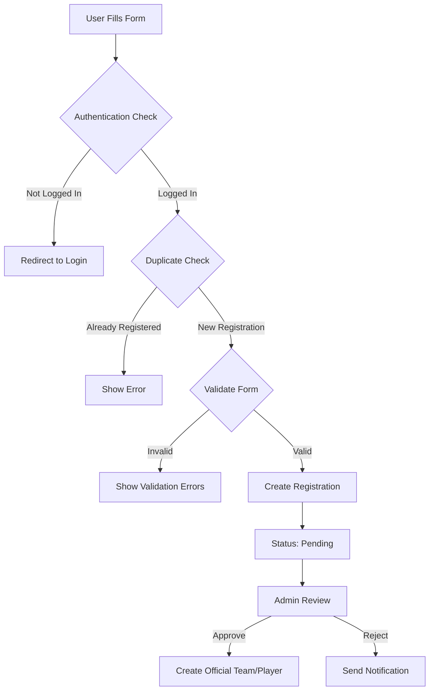

# 🏆 OCEM Sports Hub - Registration System Migration Guide

## 📋 Overview

This guide walks you through safely implementing the registration system for the OCEM Sports Hub while preserving all existing data. The migration includes database schema changes, API endpoints, and frontend integration.

## 🚨 IMPORTANT: Data Safety

**✅ SAFE MIGRATION** - All scripts are designed to:

- Preserve existing data
- Use `IF NOT EXISTS` clauses
- Work with current database state
- Allow rollback if needed

## 📂 Migration Files Created

```bash
scripts/
├── 08-registration-system-migration.sql    # Main database migration
├── 09-registration-rls-policies.sql        # Security policies
app/api/registrations/
├── individual/route.ts                      # Individual registration API
├── team/route.ts                           # Team registration API  
└── [id]/route.ts                           # Registration management API
```

## 🗄️ Database Changes Summary

### New Tables Added

1. **`individual_registrations`** - Individual sport registrations
2. **`team_registrations`** - Team sport registrations
3. **`team_registration_members`** - Team member details
4. **`registration_settings`** - Sport-specific settings

### Extended Tables

1. **`profiles`** - Added student fields (department, semester, gender, etc.)

## 🚀 Migration Steps

### Step 1: Database Migration

```bash
# Run the main migration (SAFE - won't destroy data)
psql -d your_database -f scripts/08-registration-system-migration.sql

# Apply security policies
psql -d your_database -f scripts/09-registration-rls-policies.sql
```

### Step 2: Verify Migration

```sql
-- Check new tables exist
SELECT table_name FROM information_schema.tables 
WHERE table_schema = 'public' 
AND table_name IN ('individual_registrations', 'team_registrations');

-- Check new columns in profiles
SELECT column_name FROM information_schema.columns 
WHERE table_name = 'profiles' 
AND column_name IN ('student_id', 'department', 'semester', 'gender');

-- Check default registration settings
SELECT COUNT(*) FROM registration_settings;
```

### Step 3: Test Registration System

```bash
# Start development server
npm run dev

# Test registration flows:
# 1. Navigate to /register
# 2. Select individual sport (Chess, Quiz)
# 3. Fill form and submit
# 4. Select team sport (Cricket, Football)
# 5. Fill team form and submit
```

## 🔐 Security Features

### Authentication Required

- All registration endpoints require user login
- JWT token validation on every request
- Session-based access control

### Row Level Security (RLS)

- Users can only see their own registrations
- Admins can manage all registrations
- Automatic data isolation by user ID

### Input Validation

- Server-side validation using Zod schemas
- SQL injection prevention
- XSS protection through sanitization

### Rate Limiting

- Prevent duplicate registrations
- One registration per sport per user
- Time-based registration windows

## 📊 Registration Workflow



## 🛠️ API Endpoints

### Individual Registrations

```typescript
POST /api/registrations/individual
GET /api/registrations/individual
GET /api/registrations/individual?sportId=uuid
```

### Team Registrations  

```typescript
POST /api/registrations/team
GET /api/registrations/team
GET /api/registrations/team?sportId=uuid
```

### Registration Management

```typescript
GET /api/registrations/[id]?type=individual|team
PUT /api/registrations/[id]?type=individual|team
DELETE /api/registrations/[id]?type=individual|team
```

## 🎯 Form Integration

### Individual Form (`components/individualregistration/form.tsx`)

- ✅ Connected to API endpoint
- ✅ Error handling
- ✅ Success notifications
- ✅ Form validation

### Team Form (`components/teamregistration/form.tsx`)

- ✅ Connected to API endpoint
- ✅ Team member management
- ✅ Dynamic member validation
- ✅ Captain designation

## 🚀 What's Working Now

### ✅ Completed Features

1. **Database Schema** - All tables and relationships
2. **Security** - RLS policies and validation
3. **API Endpoints** - Full CRUD operations
4. **Form Integration** - Connected to backend
5. **Validation** - Client and server-side
6. **Error Handling** - Comprehensive error states

### 🔄 Next Steps (Optional Enhancements)

1. **Admin Dashboard** - Registration management UI
2. **Email Notifications** - Registration confirmations
3. **File Uploads** - Team logos, player photos
4. **Payment Integration** - Registration fees
5. **Bulk Operations** - Mass approvals

## 🧪 Testing Checklist

### Database Testing

- [ ] Migration runs without errors
- [ ] Existing data preserved
- [ ] New tables created
- [ ] Indexes working
- [ ] RLS policies active

### API Testing

- [ ] Individual registration creates record
- [ ] Team registration creates record + members
- [ ] Duplicate prevention works
- [ ] Authentication required
- [ ] Validation errors returned

### Frontend Testing

- [ ] Individual form submits successfully
- [ ] Team form submits successfully  
- [ ] Error states display correctly
- [ ] Success notifications show
- [ ] Form resets after submission

## 🚨 Troubleshooting

### Common Issues

1. **Migration Fails**

   ```bash
   # Check if tables already exist
   \dt public.*registration*
   
   # Manual cleanup if needed
   DROP TABLE IF EXISTS public.individual_registrations CASCADE;
   ```

2. **API Errors**

   ```bash
   # Check Supabase connection
   curl -X GET "http://localhost:3000/api/health"
   
   # Verify environment variables
   echo $NEXT_PUBLIC_SUPABASE_URL
   ```

3. **RLS Blocking Queries**

   ```sql
   -- Temporarily disable RLS for testing
   ALTER TABLE public.individual_registrations DISABLE ROW LEVEL SECURITY;
   ```

## 📈 Performance Considerations

### Database Optimization

- Indexes on frequently queried columns
- Efficient RLS policies
- Proper foreign key relationships

### API Optimization

- Request validation caching
- Connection pooling
- Error response caching

## 🔒 Security Best Practices

1. **Never trust client input** - Server-side validation always
2. **Use parameterized queries** - Prevent SQL injection  
3. **Validate file uploads** - If adding file support
4. **Rate limit requests** - Prevent abuse
5. **Audit trail** - Log all registration actions

## 🎉 Success Metrics

After successful migration, you should have:

- ✅ Zero data loss
- ✅ Working registration forms
- ✅ Secure API endpoints
- ✅ Admin approval workflow
- ✅ Comprehensive error handling

---

## 🆘 Support

If you encounter any issues during migration:

1. Check the troubleshooting section above
2. Verify all environment variables are set
3. Test database connection
4. Check browser console for frontend errors
5. Review server logs for API issues

**Remember**: This migration is designed to be safe and non-destructive. Your existing data will be preserved!
